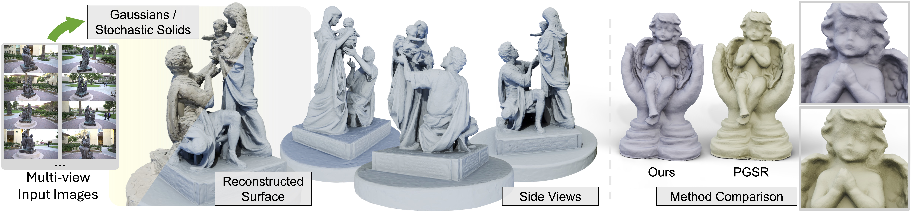

# Geometry-Grounded Gaussian Splatting

**Baowen Zhang, Chenxing Jiang, Heng Li, Shaojie Shen, Ping Tan**

[Project Page](https://baowenz.github.io/geometry_grounded_gaussian_splatting/)  


---

## 1. Installation

The code has been tested on Ubuntu 24.04 with CUDA 13.0 (driver 580.126.09), and on Ubuntu 20.04 with CUDA 12.8 (driver 570.133.07).

### Clone the repository
```bash
git clone https://github.com/HKUST-SAIL/Geometry-Grounded-Gaussian-Splatting.git --recursive
cd Geometry-Grounded-Gaussian-Splatting
```

### Create the environment
```bash
conda create -n gggs python=3.12
conda activate gggs
```

### Install PyTorch + dependencies
```bash
pip install torch torchvision --index-url https://download.pytorch.org/whl/cu130
pip install -r requirements.txt
```

### Install submodules
```bash
pip install submodules/diff-gaussian-rasterization --no-build-isolation
pip install submodules/warp-patch-ncc --no-build-isolation
pip install submodules/simple-knn --no-build-isolation
pip install git+https://github.com/rahul-goel/fused-ssim/ --no-build-isolation
```

### Marching Tetrahedra (tetra-triangulation)
```bash
conda install -y conda-forge::cgal
pip install submodules/tetra_triangulation --no-build-isolation
```

---

## 2. Data Preparation

### DTU
We train on the **preprocessed DTU dataset** from **2DGS**:  
https://surfsplatting.github.io/

For geometry evaluation, download the **official DTU point clouds** and place them under:
```text
dtu_eval/Offical_DTU_Dataset
```
DTU dataset page: https://roboimagedata.compute.dtu.dk/?page_id=36

### Tanks and Temples (TnT)
Please follow [PGSR](https://github.com/zju3dv/PGSR) to preprocess the TnT dataset. For evaluation, download the **GT point clouds**, **camera poses**, **alignments**, and **crop files** from:  
https://www.tanksandtemples.org/download/

Expected structure:
```text
GT_TNT_dataset/
  Barn/
    images/
      000001.jpg
      000002.jpg
      ...
    sparse/
      0/
        ...
    Barn.json
    Barn.ply
    Barn_COLMAP_SfM.log
    Barn_trans.txt
  Caterpillar/
    ...
```

---

## 3. Training & Evaluation

Below are example commands for training, mesh extraction, rendering, and evaluation.

### DTU

```bash
# Training
python train.py -s <path_to_dtu> -m <output_dir> -r 2 --use_decoupled_appearance 3

# Mesh extraction
python mesh_extract.py -m <output_dir>

# Evaluation
python evaluate_dtu_mesh.py -m <output_dir>
```

### Tanks and Temples (TnT)

```bash
# Training
python train.py -s <path_to_preprocessed_tnt> -m <output_dir> -r 2 --use_decoupled_appearance 3

# Mesh extraction (add --move_cpu to reduce GPU memory usage if needed)
python mesh_extract_tetrahedra.py -m <output_dir> 
# python mesh_extract_tetrahedra.py -m <output_dir> --move_cpu

# Evaluation
python eval_tnt/run.py \
  --dataset-dir <path_to_gt_tnt> \
  --traj-path <path_to_COLMAP_SfM.log> \
  --ply-path <output_dir>/recon_post.ply \
  --out-dir <output_dir>/mesh
```

### Novel View Synthesis

```bash
# Training
python train.py -s <path_to_dataset> -m <output_dir> --eval

# Rendering
python render.py -m <output_dir>

# Evaluation
python metrics.py -m <output_dir>
```

#### (Optional) With Spherical Gaussians

```bash
python train.py -s <path_to_dataset> -m <output_dir> --eval --sh_degree 2 --sg_degree 7
python render.py -m <output_dir>
python metrics.py -m <output_dir>
```

---

## 4. Viewer

The viewer is based on the original **3D Gaussian Splatting** (SIBR) viewer, with minor updates for newer library versions and for loading 3D Gaussian models.

The current version uses **embree4** and a newer version of **Boost**; if you need to build with older library versions, please refer to `SIBR_viewers/SIBR_viewers.patch` for the required changes.

Build and use it the same way as:  
https://github.com/graphdeco-inria/gaussian-splatting

---

## 5. Acknowledgements

This project builds on **Gaussian Splatting** and **RaDe-GS**:  
https://github.com/graphdeco-inria/gaussian-splatting
https://github.com/HKUST-SAIL/RaDe-GS

We refer to **gsplat** for its use of warp-level reduction to accelerate the backward pass.  
https://github.com/nerfstudio-project/gsplat

We integrate:
- Loss terms from **2DGS** and **PGSR**:  
  - https://github.com/hbb1/2d-gaussian-splatting  
  - https://github.com/zju3dv/PGSR  
- Densification strategy from **GOF**:  
  https://github.com/autonomousvision/gaussian-opacity-fields
- Filters from **Mip-Splatting**: https://github.com/autonomousvision/mip-splatting  
- Spherical Gaussian apperance model from **RayGauss** and **RayGaussX**
  https://github.com/hugobl1/ray_gauss
  https://github.com/hugobl1/raygaussx
- Appearance models from **Gaussian Splatting**, **GOF**, and **PGSR**.  
Evaluation toolkits:
- DTU: https://github.com/jzhangbs/DTUeval-python  
- Tanks and Temples: https://github.com/isl-org/TanksAndTemples/tree/master/python_toolbox/evaluation